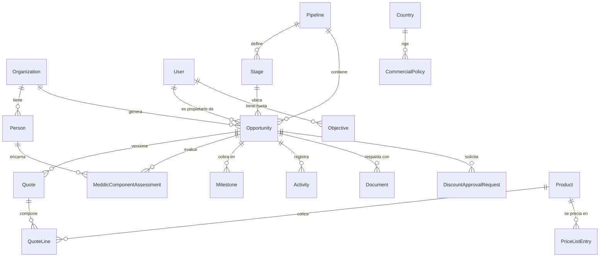
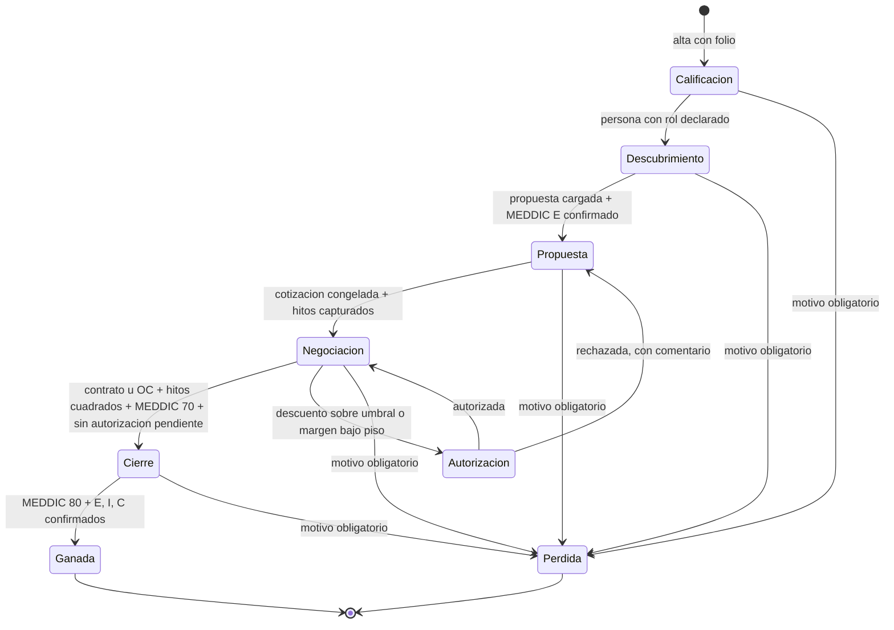
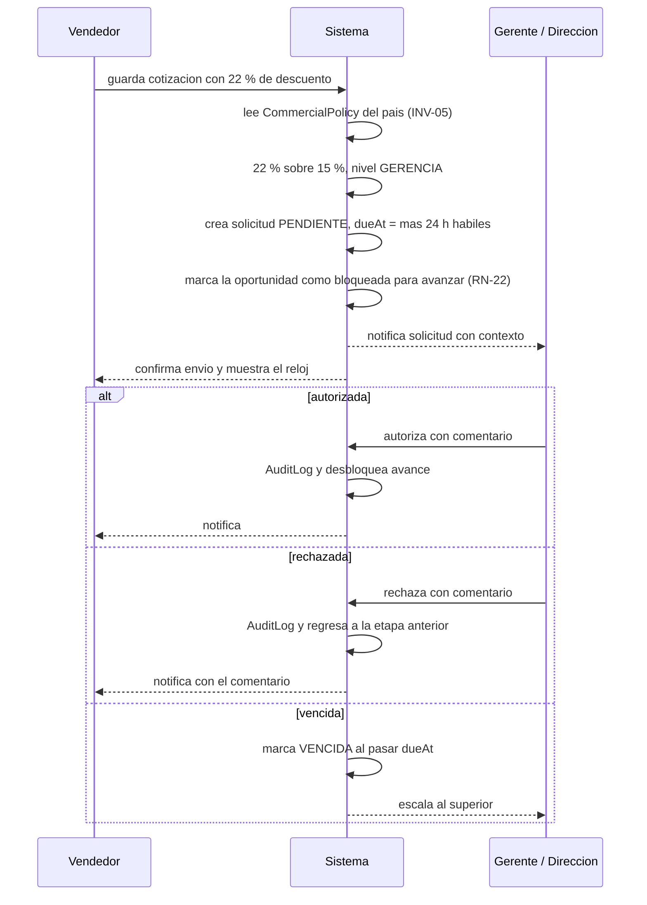

# CRM Avattar · Especificación de construcción

Documento normativo para construir el MVP. Deriva del prototipo aprobado por Dirección y de la
sesión de definición de alcance, e incorpora los cuatro puntos que el Director levantó en la
última reunión.

Sustituye al documento de alcance v1 como fuente de verdad para implementación. El documento de
alcance sigue siendo válido como material de negocio y de aprobación; cuando haya discrepancia,
**manda este documento**.

> **v2.1 · Cambio de moneda.** El 1 de septiembre de 2026 el negocio confirmó que la operación
> real de Avattar en los tres países ya cotiza en dólares. La v2.0 asumía multimoneda; esta
> versión es **monomoneda USD**. Los códigos afectados (`INV-04`, `INV-08`, `RN-10`, `AC-19`,
> `Q-10`) **no se renumeran ni se borran** — quedan marcados, para que reintroducir moneda local
> sea reactivarlos y no redescubrirlos. Detalle en `docs/decisiones-pendientes.md` §3.

---

## 0. Cómo usar este documento

**Para el agente de código.** Este documento es el contrato. Antes de escribir código:

1. Lee la sección **3. Invariantes**. Son reglas que no se negocian ni se optimizan. Si una tarea
   te obliga a violar una, detente y repórtalo en lugar de improvisar.
2. Lee la sección **4. Convenciones**. Todo el código nuevo las respeta.
3. Para cualquier tarea, localiza su sección: el modelo de datos en §6, las reglas en §8, la
   pantalla en §11, los criterios de aceptación en §14.
4. Los códigos son estables y citables: `RN-xx` regla de negocio, `F-xxx` funcionalidad,
   `INV-xx` invariante, `P-xx` pantalla, `AC-xx` criterio de aceptación.
5. Cuando una sección diga **DEBE**, es obligatorio. **NO DEBE** es prohibido. **PUEDE** es
   opcional y decidible por implementación.
6. Si algo no está especificado, está en §18 (preguntas abiertas) o simplemente no está decidido:
   pregunta, no inventes reglas de negocio. Sí puedes decidir libremente detalles de
   implementación que no cambien comportamiento observable.

**Para el humano.** §2 tiene lo que cambió respecto a la versión anterior y qué conflictos
generó. §18 tiene lo que falta cerrar.

---

## 1. Qué estamos construyendo

Un CRM de ventas para Avattar IT Solutions, consultoría de TI que opera en México, Colombia y
Chile. Reemplaza a Pipedrive. La diferencia de fondo con Pipedrive es que este sistema gobierna
**margen** y **cobro**, no solo etapas: cotiza con costo y margen visibles, exige autorización
cuando el descuento sale de política, y obliga a cuadrar un calendario de facturación antes de
poder declarar una venta ganada.

Cuatro decisiones de alcance ya tomadas:

| Ámbito | Decisión |
|---|---|
| Cobertura | MX, CO y CL productivos desde la v1: **monomoneda USD**, lista de precio única, consolidado directo |
| Integraciones | Entra ID (SSO) y Microsoft 365 (calendario, correo). Defontana **fuera** del MVP |
| Datos históricos | Arranque en limpio, sin migrar Pipedrive |
| Prioridad | Adopción primero: si el vendedor no lo usa, nada más importa |

---

## 2. Cambios respecto a la v1 del alcance

Cuatro puntos nuevos del Director, y las decisiones que se tomaron para integrarlos sin romper lo
que ya estaba definido.

### 2.1 MEDDIC como requisito para declarar una oportunidad como probable ganada

**Decisión:** se implementa MEDDIC como checklist de seis componentes **con puntaje**, y el
puntaje gatea el avance a Cierre, el marcado como ganada y la categoría de pronóstico
«Compromiso». Los mínimos se configuran sin código. Ver §7.

Conflictos resueltos:

- **MEDDIC absorbe dos gates que ya existían.** El requisito de etapa Propuesta era «propuesta
  comercial cargada + decisor económico», y Negociación pedía comité identificado. El
  «decisor económico» y el «campeón» **DEBEN** resolverse a través de los componentes MEDDIC `E`
  y `C`, no como una validación paralela. `RN-02` queda reescrita en §8.
- **La probabilidad por etapa NO cambia.** Se evaluó que el puntaje MEDDIC modificara la
  probabilidad y se decidió que **no**. El ponderado sigue siendo `valor × probabilidad de etapa`
  (`RN-01` intacta). MEDDIC gatea, no pondera. Razón: dos mecanismos que mueven el pronóstico
  al mismo tiempo hacen imposible explicar un número en el comité comercial.
- **MEDDIC se ancla a personas reales.** Los componentes `E` (decisor económico) y `C` (campeón)
  **DEBEN** apuntar a un registro de `Person` de la organización, no a texto libre. Así el comité
  de compra del prototipo y MEDDIC son la misma información, no dos capturas.

### 2.2 Filtros estratégicos en las pantallas

**Decisión:** los filtros dejan de ser un detalle por pantalla y pasan a ser un subsistema
transversal con contrato único: estado en la URL, opciones recortadas por permiso, vistas
guardadas por usuario. Ver §9. Esto asciende `F-106` de «filtros de trabajo» a módulo.

Punto que suele olvidarse y aquí es obligatorio: cuando se filtra por rango de fechas, el usuario
**DEBE** poder elegir **cuál fecha** se filtra (cierre estimado, creación, última actividad,
cierre real). Un rango de fechas sin decir sobre qué campo aplica produce reportes que nadie
puede reproducir.

### 2.3 El vendedor solo ve sus oportunidades y su propio tablero de objetivos

**Decisión:** la visibilidad sigue al **propietario** (`ownerId`), no al creador.

Conflicto resuelto: el Director dijo «las que crean». Tomado literal, un gerente no podría dar de
alta una oportunidad y asignarla, y una reasignación dejaría al vendedor nuevo sin acceso. La
regla implementada es por propietario. **Esto necesita una confirmación de una línea con el
Director** (§18, `Q-01`).

Consecuencias:

- Las pantallas de Análisis y el panel de oportunidades en riesgo **NO DEBEN** ser accesibles al
  rol Vendedor.
- Los indicadores de encabezado del pipeline, para un Vendedor, se calculan **solo sobre su propio
  conjunto**. Un vendedor nunca ve el total de la oficina, ni por agregación.
- El tablero de objetivos, para un Vendedor, muestra **solo su renglón**. No ve la cuota ni el
  avance de sus compañeros.
- El crédito compartido (`F-113`) sigue en Fase 2, pero la regla elegida es compatible: cuando
  llegue, la visibilidad se extiende a copropietarios sin rediseñar nada.

### 2.4 Objetivos por trimestre y por año

**Decisión:** el modelo de objetivos maneja periodo anual y trimestral, con conmutador en la
pantalla. Ver §10. Se asume **año fiscal = año calendario** (T1 = enero–marzo), inferido del
prototipo, que muestra septiembre dentro de T3. **Confirmar** (§18, `Q-02`).

### 2.5 Monomoneda USD · v2.1

**Decisión:** se captura y almacena todo en dólares en los tres países. No hay tabla de tipos de
cambio, no hay congelamiento de tipo de cambio al ganar, y la lista de precio es única y global.

Razón: la operación real de Avattar en los tres países ya cotiza en dólares. El supuesto de
multimoneda de la v2.0 no correspondía a cómo opera el negocio.

Lo que **sí** se conserva a propósito: el enum `Currency` con el único valor `USD`, y las columnas
`currency` en `Opportunity`, `Quote`, `Pipeline` y `Objective`. Reintroducir moneda local sería
agregar valores al enum y una tabla de tipos de cambio, no repintar cinco tablas.

**Lo que esto no resuelve:** facturar en México, Colombia y Chile normalmente exige el monto en
moneda local para SAT, DIAN y SII. Cotizar en dólares y facturar en moneda local son cosas
distintas. La integración con Defontana (Fase 2) tendrá que resolver esa conversión en su propia
capa. Ver `docs/decisiones-pendientes.md` §3.

---

## 3. Invariantes

Reglas que el sistema nunca viola. Si una tarea parece exigir romper una, la tarea está mal
planteada: repórtalo.

| Cód. | Invariante |
|---|---|
| **INV-01** | **Toda consulta que devuelva oportunidades pasa por el helper de alcance.** Nunca `prisma.opportunity.findMany` directo en una ruta, componente o Server Action. Siempre a través de `scopeOpportunities(session)`. Lo mismo para organizaciones, actividades y objetivos. La autorización vive en la capa de datos, no en la UI. |
| **INV-02** | **El costo y la utilidad no salen del servidor si el usuario no tiene permiso.** No basta ocultarlos en el componente: la respuesta serializada **NO DEBE** contener `unitCost`, `totalCost` ni `grossProfit` para un usuario sin `VER_COSTO`. Usar selectores explícitos, nunca `select: *`. |
| **INV-03** | **El dinero no se calcula con `number`.** Todo importe es `Decimal(18,4)` en base y se opera con `Decimal` en el servidor. Los porcentajes se guardan como fracción (`0.1500` = 15 %), no como 15. |
| **INV-04** | **Todo importe viaja con su moneda.** No existe un monto sin `currency`. Bajo monomoneda (§2.5) esa moneda es siempre `USD`, así que el invariante se cumple trivialmente — pero la columna se conserva. |
| **INV-05** | **Ningún umbral está escrito en el código.** Piso de margen, umbrales de descuento, mínimos MEDDIC, días para estancada, tasa de impuesto y probabilidad de etapa se leen de la base (`CommercialPolicy`, `Stage`, `Country`). Un literal `0.20`, `0.15` o `0.16` en lógica de negocio es un defecto. |
| **INV-06** | **Una cotización congelada es inmutable.** Editarla no es posible; se crea una versión nueva. El histórico de versiones no se borra. |
| **INV-07** | **No se marca ganada una oportunidad sin cumplir todas sus condiciones** (hitos cuadrados, MEDDIC sobre el mínimo, documento de respaldo, sin autorizaciones pendientes). La validación vive en el servicio de dominio, no en el formulario. |
| **INV-08** | ~~**El tipo de cambio se congela al ganar.**~~ **Sin efecto bajo monomoneda (§2.5).** No se renumera. |
| **INV-09** | **Las acciones sensibles escriben en `AuditLog`** en la misma transacción que el cambio: autorizaciones, cambios de precio sobre cotización congelada, reapertura de oportunidad, edición de catálogos, exportación con costo, cambio de propietario. Si el log falla, la operación falla. |
| **INV-10** | **El estado de los filtros vive en la URL.** Toda pantalla de lista lee sus filtros de `searchParams`. Nada de estado de filtro solo en memoria: la vista tiene que ser compartible y el botón de regresar tiene que funcionar. |
| **INV-11** | **Las banderas de riesgo se calculan, no se capturan.** No hay campo editable de «en riesgo». Se derivan de actividad, etapa y margen. |
| **INV-12** | **El folio es inmutable.** Se asigna al crear y no cambia nunca, ni al reabrir. Consecutivo **por año**. |
| **INV-13** | **Las etapas y sus probabilidades son datos, no código.** No existe un `enum Stage` en el schema; `Stage` es una tabla. Un `switch` sobre nombres de etapa es un defecto. |
| **INV-14** | **La UI siempre está en español.** Identificadores en inglés, valores de negocio y textos visibles en español. Sin cadenas en inglés en pantalla. |
| **INV-15** | **Nada se borra en duro.** Las entidades de negocio usan borrado lógico (`deletedAt`). Las consultas excluyen borrados por omisión. |

---

## 4. Convenciones

### 4.1 Nomenclatura

Híbrido: **identificadores en inglés, valores de negocio en español.**

```
// correcto
opportunities.stage_id, quotes.gross_margin, milestones.due_date
stage.name              = "Negociación"
lossReason.name         = "Precio"
OrganizationType        = CLIENTE | PROSPECTO | PARTNER | FABRICANTE | PROVEEDOR

// incorrecto
oportunidades.etapa_id            // identificador en español
organizationType = "CUSTOMER"     // valor de negocio en inglés
```

- Tablas y campos: `snake_case` en PostgreSQL, `camelCase` en el cliente Prisma (usar `@map`).
- Modelos Prisma: `PascalCase` singular (`Opportunity`, no `Opportunities`).
- Valores de enum: `SCREAMING_SNAKE_CASE` en español (`GERENTE_PAIS`, `PRECIO_FIJO`).
- Rutas: en español, porque son visibles (`/oportunidades`, `/contactos`, `/objetivos`).
- Componentes y funciones: inglés (`OpportunityCard`, `computeMeddicScore`).

### 4.2 Estructura de carpetas

```
app/
  (auth)/                     login, callback de Entra ID, sin-acceso
  (app)/
    oportunidades/            P-01 lista · P-02 detalle
    contactos/                P-03 P-04 P-05
    productos/                P-06
    actividades/              P-07
    objetivos/                P-08
    analisis/                 P-09
    autorizaciones/           P-10
    admin/                    P-11
  api/
lib/
  db.ts          PrismaClient · solo lib/scope y lib/domain lo importan
  auth/          sesión, roles, helpers de permiso
  scope/         scopeOpportunities, scopeOrganizations, scopeObjectives  → INV-01
  domain/        servicios: quote, milestone, meddic, approval, opportunity
  money/         wrapper de Decimal, formateo
  filters/       definición y parseo de filtros  → §9
  policy/        lectura de CommercialPolicy y Country  → INV-05
  audit/         escritura de AuditLog  → INV-09
components/
  ui/            primitivas del sistema de diseño  → §13
  pipeline/ quote/ meddic/ filters/ ...
prisma/
  schema.prisma  seed.ts
supabase/
  migrations/    SQL generado desde Prisma, aplicado vía MCP
docs/
  CRM-AVTR-SPEC.md   (este documento)
```

### 4.3 Reglas de implementación

- Las mutaciones son **Server Actions** que delegan en un servicio de `lib/domain`. La Server
  Action valida entrada (Zod) y autoriza; el servicio aplica la regla de negocio. Nada de lógica
  de negocio dentro de un componente.
- Toda operación que cambie más de una tabla va en `prisma.$transaction`.
- Los cálculos de cotización, puntaje MEDDIC y cuadre de hitos son **funciones puras** en
  `lib/domain`, probadas con tests unitarios. La UI nunca recalcula por su cuenta.
- Fechas: se guardan en UTC. Se muestran en la zona del país de la oficina. Las fechas «de
  negocio» sin hora (cierre estimado, vencimiento de hito) son `@db.Date`.
- **`app/**` y `components/**` no pueden importar `lib/db` ni `@prisma/client`.** Lo aplica
  `eslint.config.mjs` y lo verifica una prueba de arquitectura (AC-32).

---

## 5. Actores, roles y visibilidad

### 5.1 Roles

| Rol | Enum | Alcance de datos |
|---|---|---|
| Vendedor | `VENDEDOR` | Solo lo propio: oportunidades donde es propietario, sus actividades, su renglón de objetivos |
| Gerente de país | `GERENTE_PAIS` | Toda su oficina (uno o más países asignados) |
| Dirección | `DIRECCION` | Los tres países, consolidado |
| Administrador | `ADMINISTRADOR` | Configuración del sistema; datos comerciales en lectura |
| Preventa | `PREVENTA` | Oportunidades donde está asignado como apoyo técnico. **Pendiente de confirmación** (§18, `Q-03`) |

### 5.2 Matriz de permisos

Se implementa como datos, no como condicionales dispersos. Cada permiso es una fila; el rol define
el valor. La matriz es editable desde Administración (`F-1005`).

| Permiso | VENDEDOR | GERENTE_PAIS | DIRECCION | ADMINISTRADOR |
|---|---|---|---|---|
| `VER_OPORTUNIDADES_PROPIAS` | sí | sí | sí | sí |
| `VER_OPORTUNIDADES_OFICINA` | **no** | sí | sí | sí |
| `VER_MARGEN` | sí | sí | sí | sí |
| `VER_COSTO` | **no** | sí | sí | sí |
| `AUTORIZAR_DESCUENTO` | no | hasta 30 % | sin límite | no |
| `EDITAR_CATALOGOS` | no | no | no | sí |
| `REABRIR_OPORTUNIDAD` | no | no | no | sí |
| `EXPORTAR_CON_COSTO` | no | sí | sí | sí |
| `VER_ANALISIS` | **no** | sí | sí | sí |
| `VER_OBJETIVOS_EQUIPO` | **no** | sí | sí | sí |
| `EDITAR_POLITICA_COMERCIAL` | no | no | sí | sí |

`VER_MARGEN` y `VER_COSTO` son permisos **independientes**: el vendedor conoce su margen sin
conocer el costo unitario del proveedor (`RN-09`).

### 5.3 Reglas de alcance de datos

Implementadas en `lib/scope`. Toda lectura pasa por aquí (`INV-01`).

```ts
// lib/scope/opportunities.ts
export function opportunityScope(session: Session): Prisma.OpportunityWhereInput {
  const base = { deletedAt: null };
  switch (session.role) {
    case 'VENDEDOR':
      // visibilidad por PROPIETARIO, no por creador  → §2.3
      return { ...base, ownerId: session.userId };
    case 'GERENTE_PAIS':
      return { ...base, countryCode: { in: session.countryCodes } };
    case 'DIRECCION':
    case 'ADMINISTRADOR':
      return base;
    case 'PREVENTA':
      return { ...base, supportUsers: { some: { userId: session.userId } } };
  }
}
```

Reglas derivadas, todas obligatorias:

- **Organizaciones.** Un Vendedor ve una organización si es su propietario **o** si tiene al
  menos una oportunidad propia en ella. Los indicadores de la ficha (`pipeline abierto`,
  `ganado 12 meses`) se calculan **solo sobre las oportunidades que ese usuario puede ver**, no
  sobre el total de la cuenta. Si no fuera así, un vendedor deduciría el pipeline de su compañero
  restando.
- **Actividades.** Propias, más las que estén ligadas a oportunidades u organizaciones visibles.
- **Objetivos.** Un Vendedor solo lee la fila cuyo `userId` es el suyo.
- **Autorizaciones.** El Vendedor ve las solicitudes que él originó, en lectura. El autorizador ve
  las de su alcance. Nadie autoriza una solicitud propia.
- **Productos y listas de precio.** Visibles para todos los roles; las columnas de costo se
  eliminan de la respuesta si falta `VER_COSTO` (`INV-02`).
- **Análisis.** Denegado a `VENDEDOR`. La ruta responde 403, no una pantalla vacía.

---

## 6. Modelo de datos

### 6.1 Mapa de entidades



### 6.2 Schema Prisma normativo

La fuente ejecutable es `prisma/schema.prisma`; si hay diferencia, **gana el archivo**, y este
documento se actualiza.

**Cambios de la v2.1 (monomoneda, §2.5):** desaparecen el modelo `ExchangeRate` y el campo
`Opportunity.frozenExchangeRate`; `PriceListEntry` pierde las dimensiones `countryCode` y
`currency` y pasa a ser lista única global. Se agrega `FolioCounter`, que `RN-20` exige y que la
generación anterior del esquema resolvía mal con una secuencia global.

Enums, todos con valores de negocio en español (§4.1):

```
Role             VENDEDOR GERENTE_PAIS DIRECCION ADMINISTRADOR PREVENTA
CountryCode      MX CO CL
Currency         USD                       -- §2.5 monomoneda
OrganizationType CLIENTE PROSPECTO PARTNER FABRICANTE PROVEEDOR
OpportunityStatus ABIERTA GANADA PERDIDA
ForecastCategory PIPELINE MEJOR_CASO COMPROMISO OMITIDA
BusinessType     NUEVO EXPANSION RENOVACION
PriceModel       PRECIO_FIJO TIEMPO_Y_MATERIALES RECURRENTE RECURRENTE_ANUAL POR_CONSUMO
QuoteStatus      BORRADOR CONGELADA REEMPLAZADA
MilestoneStatus  PENDIENTE CUMPLIDO
MeddicComponent  METRICAS DECISOR_ECONOMICO CRITERIOS_DECISION PROCESO_DECISION
                 DOLOR_IDENTIFICADO CAMPEON
MeddicStatus     NO_EVALUADO AUSENTE PARCIAL CONFIRMADO
ApprovalLevel    GERENCIA DIRECCION
ApprovalStatus   PENDIENTE AUTORIZADA RECHAZADA VENCIDA
ObjectivePeriod  ANUAL TRIMESTRAL
StageGateMode    ADVERTENCIA BLOQUEANTE
```

Modelos, con lo que cada uno aporta y lo que no es obvio:

| Modelo | Tabla | Notas normativas |
|---|---|---|
| `User` | `users` | `entraObjectId` único para el SSO. `countryCodes` es arreglo: un gerente puede llevar dos países. Borrado lógico |
| `Country` | `countries` | `taxRate` como fracción y `fiscalYearStartMonth` (Q-02). INV-05: nunca un `0.16` literal en código |
| `CommercialPolicy` | `commercial_policies` | Uno por país. Aquí viven **todos** los umbrales: pisos de margen, umbrales de descuento, mínimos MEDDIC, SLA y cobertura sana |
| `Pipeline` | `pipelines` | Uno por país mínimo, más Renovaciones MX |
| `Stage` | `stages` | INV-13: **tabla, no enum**. `probability` `Decimal(5,4)`, `staleAfterDays`, `gateMode` y `gateRequires` como arreglo de cadenas declarativas (§8.3) |
| `Organization` | `organizations` | `taxId` cubre RFC, NIT y RUT. `parentId` para matriz-filial (Fase 2). Borrado lógico |
| `Person` | `people` | Pertenece a **una** organización. `committeeRoleId` la liga al comité de compra, que es la misma información que MEDDIC usa (§2.1) |
| `Opportunity` | `opportunities` | `folio` único e inmutable. `ownerId` es el campo del que cuelga toda la visibilidad (§2.3). `amount` y `meddicScore` desnormalizados a propósito. `primaryPersonId` es **opcional**: exigirlo pelea contra la captura rápida |
| `FolioCounter` | `folio_counters` | `(year, lastNumber)`. `UPDATE … RETURNING` dentro de la transacción de alta. RN-20 |
| `StageTransition` | `stage_transitions` | Toda transición, incluidos los retrocesos. `gateOverride` marca que se avanzó con una advertencia |
| `OpportunitySupport` | `opportunity_support` | Preventa asignada como apoyo. Q-03 |
| `MeddicComponentAssessment` | `meddic_assessments` | Único por `(opportunityId, component)`. `evidence` obligatoria en `PARCIAL` y `CONFIRMADO`; `personId` obligatorio para `E` y `C` en `CONFIRMADO` (RN-30) |
| `MeddicWeight` | `meddic_weights` | Por pipeline. Suman 100. Editable sin desplegar (AC-17) |
| `Product` / `ProductFamily` | `products` / `product_families` | `costSource` y `costUpdatedAt` existen por Q-05: sin Defontana, el costo se desactualiza si nadie lo mantiene |
| `PriceListEntry` | `price_list_entries` | **Lista única y global** (§2.5). `minPrice` es piso duro (RN-08). Vigencia por fechas (RN-26) |
| `Quote` | `quotes` | Totales **persistidos**, no calculados en vista: hay que poder congelarlos. `taxRate` copiada del país al crear (RN-24). `frozenAt` sella INV-06 |
| `QuoteLine` | `quote_lines` | `productId` nulo = concepto libre (Q-07). `unitCost` **no se serializa** sin `VER_COSTO` (INV-02) |
| `Milestone` | `milestones` | **Siempre monto**, nunca porcentaje. Ver §6.3 |
| `DiscountApprovalRequest` | `discount_approval_requests` | `dueAt` por SLA (RN-21). `resolutionComment` obligatorio al resolver (RN-17) |
| `Activity` | `activities` | `externalEventId` para la sincronía con M365. Borrado lógico |
| `Document` | `documents` | `storageKey` apunta a Supabase Storage. Ligado a oportunidad u organización, ambos opcionales |
| `ActivityType`, `DocumentType`, `LossReason`, `CommitteeRole`, `OpportunitySource` | — | Catálogos **dedicados**, no una tabla genérica: tienen comportamiento propio (`isContract`, `requiresCompetitor`) |
| `Objective` | `objectives` | Dos cuotas por fila: ingreso y utilidad. `periodType` más `quarter` nulo para el anual |
| `AuditLog` | `audit_logs` | INV-09. Se escribe en la misma transacción que el cambio |
| `SavedView` | `saved_views` | Los `searchParams` serializados. §9.5 |
| `Permission` / `RolePermission` | `permissions` / `role_permissions` | La matriz de §5.2 como datos. `limitValue` para «autorizar hasta 30 %» |

### 6.3 Notas de modelado

- **Dinero.** `Decimal(18,4)` en base, `Decimal` en el servidor (`INV-03`). Al serializar a
  cliente, convertir a string, nunca a `number`.
- **Porcentajes.** Fracción (`0.1500`). El formateo a «15 %» es de presentación.
- **Hitos: monto, no porcentaje.** La captura permite alternar `%` y monto (`F-302`), pero lo
  almacenado siempre es monto. Así, si la cotización cambia, el sistema puede avisar que el
  calendario dejó de cuadrar en lugar de recalcular silenciosamente.
- **`amount` de la oportunidad.** Espejo del neto de la cotización activa. Se actualiza en la
  misma transacción en que cambia la cotización. Existe para que el kanban y los agregados no
  tengan que unir contra `quotes` en cada consulta.
- **`meddicScore`.** Igual: desnormalizado para filtrar y ordenar. Se recalcula en la misma
  transacción en que cambia un componente. Nunca se edita a mano.
- **`stageEnteredAt`.** Se sella en cada transición. Es la base de `RN-03`.
- **Borrado lógico** (`INV-15`) en Organization, Person, Opportunity, Activity y User. Catálogos
  usan `active`.
- **RLS.** Deny-all en todas las tablas de `public`, habilitado en la **misma migración** que las
  crea. Separar ambas cosas es lo que dejó once tablas descubiertas en el esquema anterior. Es
  respaldo, no autorización: la autorización vive en `lib/scope` (`INV-01`).

---

## 7. MEDDIC

### 7.1 Modelo

Seis componentes, uno por fila en `MeddicComponentAssessment`, con estado y evidencia.

| Componente | Enum | Qué se confirma | Ancla |
|---|---|---|---|
| **M**étricas | `METRICAS` | El impacto está cuantificado y el cliente lo reconoce como suyo | texto |
| **E**conomic buyer | `DECISOR_ECONOMICO` | Está identificado **y contactado** quien firma el presupuesto | `Person` |
| **D**ecision criteria | `CRITERIOS_DECISION` | Se conocen los criterios técnicos, comerciales y de servicio con que van a comparar | texto |
| **D**ecision process | `PROCESO_DECISION` | Está mapeado el proceso: pasos, aprobaciones y fechas | texto |
| **I**dentify pain | `DOLOR_IDENTIFICADO` | El dolor está identificado y **aceptado por el cliente**, no supuesto por nosotros | texto |
| **C**hampion | `CAMPEON` | Hay un campeón interno identificado y activo | `Person` |

Estados y puntos:

| Estado | Puntos | Significado |
|---|---|---|
| `NO_EVALUADO` | 0 | Todavía no se trabajó |
| `AUSENTE` | 0 | Se trabajó y se concluyó que no existe. Distinto de no evaluado: es información |
| `PARCIAL` | 1 | Hay avance con evidencia, no está cerrado |
| `CONFIRMADO` | 2 | Cerrado, con evidencia |

`E` y `C` **DEBEN** referenciar una `Person` de la organización para poder marcarse `CONFIRMADO`.
Esa persona es la misma que aparece en el comité de compra de la ficha de cuenta: una sola captura.

### 7.2 Cálculo del puntaje

```ts
// lib/domain/meddic.ts — función pura, con tests. INV-05: los pesos vienen de la base.
export function computeMeddicScore(
  assessments: { component: MeddicComponent; status: MeddicStatus }[],
  weights: Record<MeddicComponent, number>,   // suman 100
): number {
  const points = { NO_EVALUADO: 0, AUSENTE: 0, PARCIAL: 1, CONFIRMADO: 2 };
  const total = assessments.reduce(
    (acc, a) => acc + points[a.status] * weights[a.component], 0,
  );
  return Math.round(total / 2);   // 2 = puntos máximos por componente → 0..100
}
```

Pesos por omisión: cinco componentes a 17 y `DOLOR_IDENTIFICADO` a 15, para que sumen 100.
Configurables por pipeline (`MeddicWeight`). Si el negocio decide que el decisor económico pesa
más, se cambia sin desplegar código. Q-08.

### 7.3 Gates

Los tres mínimos se leen de `CommercialPolicy` (`INV-05`):

| Gate | Campo | Valor propuesto | Regla |
|---|---|---|---|
| Entrar a la etapa de Cierre | `meddicMinToClosing` | 70 | `RN-27` |
| Marcar como ganada | `meddicMinToWin` | 80 | `RN-28` |
| Categoría de pronóstico «Compromiso» | `meddicMinToCommit` | 70 | `RN-29` |

Además, para marcar ganada, los componentes `DECISOR_ECONOMICO`, `DOLOR_IDENTIFICADO` y `CAMPEON`
**DEBEN** estar en `CONFIRMADO`, independientemente del puntaje. Se puede llegar a 80 puntos con
buenas métricas y sin campeón, y eso no es una venta cerrable.

El gate de «Compromiso» es el que más le importa al Director: **nadie mete un negocio al
compromiso del trimestre sin MEDDIC**. Es la diferencia entre un pronóstico y un deseo.

### 7.4 Comportamiento en pantalla

- Pestaña **MEDDIC** en el detalle de la oportunidad (`P-02`), con los seis componentes, su
  estado, su evidencia y el puntaje calculado arriba.
- La tarjeta del kanban muestra el puntaje como número pequeño con color: rojo bajo 50,
  ámbar 50–69, verde 70 o más.
- Al intentar avanzar a Cierre o marcar ganada sin cumplir, el sistema **DEBE** decir exactamente
  qué componente falta y a qué estado tiene que llegar. Nunca un «no se puede» genérico.
- El puntaje es filtrable y ordenable (§9).

---

## 8. Reglas de negocio

### 8.1 Catálogo normativo

La columna «Se aplica en» dice dónde vive la regla. Si una regla se aplica en dos lugares, hay
duplicación y eso es un defecto.

| Cód. | Regla | Se aplica en | Valor por omisión |
|---|---|---|---|
| RN-01 | La probabilidad la fija la etapa, no el usuario. Ponderado = `amount × stage.probability`. **MEDDIC no altera esta fórmula.** | `lib/domain/pipeline.ts` | 10/25/50/75/90 % |
| RN-02 | Cada etapa declara sus requisitos de entrada en `Stage.gateRequires`. El evaluador es genérico: recibe la oportunidad y la lista de requisitos. **Los requisitos de comité se resuelven vía MEDDIC**, no como validación aparte | `lib/domain/stageGate.ts` | ver §8.3 |
| RN-03 | Una oportunidad está estancada si `now - stageEnteredAt > stage.staleAfterDays`. El contador se reinicia solo al cambiar de etapa, no al registrar cualquier actividad | `lib/domain/riskFlags.ts` | 14/21/30/21/10 días |
| RN-04 | El descuento escala por nivel: sobre `discountThresholdMgmt` autoriza Gerencia; sobre `discountThresholdDir`, Dirección. **Nadie autoriza su propia solicitud** | `lib/domain/approval.ts` | 15 % / 30 % |
| RN-05 | Margen bajo `marginFloor` marca la cotización y exige autorización. Una línea bajo `lineMarginFloor` se señala aunque el total cumpla | `lib/domain/quote.ts` | 20 % / 10 % |
| RN-06 | No se gana sin: hitos que sumen exactamente el neto, documento de tipo contrato u orden de compra cargado, cero autorizaciones pendientes **y MEDDIC sobre el mínimo** (RN-28) | `lib/domain/opportunity.ts` | diferencia = 0 |
| RN-07 | Fórmulas de cotización. `neto = precio × (1 − descuento)`; `importe = neto × cantidad`; `utilidad = importe − (costo × cantidad)`; `margen = utilidad ÷ importe`. Margen de un importe cero es cero, no división por cero | `lib/domain/quote.ts` | fijas |
| RN-08 | `minPrice` de la lista es piso duro. Un descuento que baje de ahí no se guarda; el error dice el piso aplicable | `lib/domain/quote.ts` | por SKU |
| RN-09 | `VER_MARGEN` y `VER_COSTO` son permisos independientes. El vendedor ve margen sin ver costo unitario. Se aplica al **serializar**, no al renderizar (INV-02) | `lib/scope/selectors.ts` | vendedor: margen sí |
| RN-10 | ~~El tipo de cambio se congela al ganar.~~ **Sin efecto bajo monomoneda (§2.5)** | — | — |
| RN-11 | El crédito puede repartirse entre propietarios y la suma debe ser 100 %. **Fase 2**; la regla de visibilidad ya es compatible | — | 100 % al propietario |
| RN-12 | Tres estados: `ABIERTA`, `GANADA`, `PERDIDA`. Solo las abiertas cuentan en pipeline, ponderado y cobertura | `lib/scope/opportunities.ts` | — |
| RN-13 | Banderas de riesgo calculadas, nunca capturadas: sin actividad futura, estancada, margen bajo el piso | `lib/domain/riskFlags.ts` | tres banderas |
| RN-14 | Visibilidad en dos dimensiones: el rol define qué se puede hacer, la oficina define sobre qué datos | `lib/scope/*` | gerente: su país |
| RN-15 | La categoría de pronóstico es independiente de la etapa. Es el juicio del vendedor, con el límite de RN-29 | `lib/domain/opportunity.ts` | `PIPELINE` |
| RN-16 | Perder exige motivo del catálogo. Si el motivo tiene `requiresCompetitor`, exige también el competidor | `lib/domain/opportunity.ts` | 8 motivos |
| RN-17 | Resolver una autorización exige comentario. La traza es inmutable y se escribe en `AuditLog` | `lib/domain/approval.ts` | — |
| RN-18 | Solo `ADMINISTRADOR` reabre una oportunidad cerrada, con motivo y traza. El folio no cambia | `lib/domain/opportunity.ts` | — |
| RN-19 | La moneda la determina el pipeline y no cambia después de crear la oportunidad. Bajo §2.5 es siempre `USD` | `lib/domain/opportunity.ts` | USD |
| RN-20 | El folio es único e inmutable, formato `OPP-AAAA-NNNNN`, **consecutivo por año**. Se genera con un contador en base (`FolioCounter`), no con `count()+1` | `lib/domain/folio.ts` | — |
| RN-21 | Las autorizaciones tienen plazo: `dueAt = createdAt + approvalSlaHours` en horas hábiles. Al vencer se marca `VENCIDA` y se notifica al superior | `lib/domain/approval.ts` | 24 h hábiles |
| RN-22 | Una autorización `PENDIENTE` bloquea el avance a la etapa de cierre. El rechazo devuelve la oportunidad a la etapa anterior con el comentario del autorizador | `lib/domain/stageGate.ts` | bloqueante |
| RN-23 | Los hitos de oportunidades ganadas son facturación **firme**; los de abiertas, **ponderada** por la probabilidad de su etapa | `lib/domain/forecast.ts` | — |
| RN-24 | El impuesto viene de `Country.taxRate` y se **copia** a la cotización al crearla, para que un cambio de tasa no altere cotizaciones históricas | `lib/domain/quote.ts` | MX 16 % · CO/CL 19 % (Q-04) |
| RN-25 | Cobertura = pipeline abierto que cierra en el periodo ÷ brecha pendiente de cuota. Alerta bajo `healthyCoverageMin` | `lib/domain/objectives.ts` | 3.0× |
| RN-26 | Se cotiza con la lista vigente a la fecha. Cambiar una lista no altera cotizaciones congeladas | `lib/domain/pricing.ts` | vigencia por fechas |
| **RN-27** | **No se entra a la etapa de cierre con `meddicScore < meddicMinToClosing`** | `lib/domain/stageGate.ts` | 70 |
| **RN-28** | **No se marca ganada con `meddicScore < meddicMinToWin`, ni si `DECISOR_ECONOMICO`, `DOLOR_IDENTIFICADO` o `CAMPEON` no están `CONFIRMADO`** | `lib/domain/opportunity.ts` | 80 |
| **RN-29** | **No se asigna categoría `COMPROMISO` con `meddicScore < meddicMinToCommit`** | `lib/domain/opportunity.ts` | 70 |
| **RN-30** | **Un componente MEDDIC en `PARCIAL` o `CONFIRMADO` exige evidencia no vacía. `DECISOR_ECONOMICO` y `CAMPEON` en `CONFIRMADO` exigen además una `Person` ligada** | `lib/domain/meddic.ts` | — |
| **RN-31** | **La visibilidad del vendedor sigue a `ownerId`, no a `createdById`.** Cambiar de propietario transfiere el acceso y se registra en `AuditLog` | `lib/scope/opportunities.ts` | — |
| **RN-32** | **Un objetivo anual y sus cuatro trimestrales pueden coexistir. Si coexisten, la suma de los trimestres debe igualar el anual;** el sistema avisa cuando no cuadra y el anual manda para el reporte de año | `lib/domain/objectives.ts` | — |

### 8.2 Reglas que necesitan ejemplo

**RN-07 · Cálculo de una línea.** Dado precio de lista 18 000, cantidad 20, descuento 10 %,
costo 9 500:

```
neto     = 18000 × (1 − 0.10) = 16200
importe  = 16200 × 20          = 324000
costo    = 9500 × 20           = 190000
utilidad = 324000 − 190000     = 134000
margen   = 134000 ÷ 324000     = 0.4136  → «41.4 %»
```

**RN-06 · Cuadre de hitos.** Neto de la cotización 1 000 000. Hitos: 300 000 + 200 000 + 300 000
= 800 000. Diferencia 200 000 → **no se puede ganar**. El mensaje **DEBE** decir «faltan
$200,000 por asignar», no «los hitos no cuadran».

**RN-04 y RN-22 · Escalamiento y bloqueo.**

```
Dado    una cotización con descuento global de 22 % y política MX (mgmt 15 %, dir 30 %)
Cuando  el vendedor guarda la cotización
Entonces se crea una DiscountApprovalRequest con level = GERENCIA y dueAt = +24 h hábiles
Y        la oportunidad no puede pasar a la etapa de cierre mientras esté PENDIENTE
Y        si el gerente rechaza, la oportunidad regresa a la etapa anterior con el comentario
```

**RN-28 · Ganar con MEDDIC.**

```
Dado    meddicScore = 84 y meddicMinToWin = 80
Y       CAMPEON en estado PARCIAL
Cuando  el vendedor intenta marcar la oportunidad como ganada
Entonces el sistema lo impide
Y        el mensaje dice: «Campeón está en Parcial y debe estar Confirmado para poder ganar»
```

**RN-20 · Folio.** El consecutivo **NO DEBE** derivarse de `count()`, porque dos altas
simultáneas producirían el mismo folio. Usar `FolioCounter` con `UPDATE … RETURNING` dentro de la
transacción. El consecutivo reinicia cada año: el 1-ene-2027 el siguiente folio es
`OPP-2027-00001`.

**RN-31 · Cambio de propietario.**

```
Dado    una oportunidad con owner = Paulina y un Vendedor autenticado como Paulina
Cuando  el Gerente cambia el propietario a Gabriel
Entonces Paulina deja de ver la oportunidad en su pipeline
Y        Gabriel la ve en el suyo
Y        queda un AuditLog con action = "CAMBIAR_PROPIETARIO", before y after
```

### 8.3 Requisitos de entrada por etapa (`Stage.gateRequires`)

Cadenas declarativas que el evaluador genérico interpreta. Valor semilla para «Ventas México»:

| Etapa | Prob. | `gateRequires` | Días estancada |
|---|---|---|---|
| Calificación | 10 % | `[]` | 14 |
| Descubrimiento | 25 % | `["PERSONA_CON_ROL_DECLARADO"]` | 21 |
| Propuesta | 50 % | `["PROPUESTA_CARGADA", "MEDDIC_E_CONFIRMADO"]` | 30 |
| Negociación | 75 % | `["COTIZACION_CONGELADA", "HITOS_CAPTURADOS"]` | 21 |
| Cierre | 90 % | `["CONTRATO_O_OC_CARGADO", "HITOS_CUADRADOS", "MEDDIC_MIN_CIERRE", "SIN_AUTORIZACION_PENDIENTE"]` | 10 |

Requisitos disponibles para el evaluador:

```ts
type GateRequirement =
  | 'PERSONA_CON_ROL_DECLARADO'   // la oportunidad tiene primaryPerson con committeeRole
  | 'PROPUESTA_CARGADA'           // existe Document de tipo propuesta comercial
  | 'CONTRATO_O_OC_CARGADO'       // existe Document con type.isContract = true
  | 'COTIZACION_CONGELADA'        // existe Quote con status = CONGELADA
  | 'HITOS_CAPTURADOS'            // milestones.length > 0
  | 'HITOS_CUADRADOS'             // suma de hitos = neto de la cotización congelada
  | 'MEDDIC_E_CONFIRMADO'         // componente DECISOR_ECONOMICO en CONFIRMADO
  | 'MEDDIC_MIN_CIERRE'           // meddicScore >= policy.meddicMinToClosing
  | 'SIN_AUTORIZACION_PENDIENTE'; // ninguna DiscountApprovalRequest en PENDIENTE
```

Agregar un requisito nuevo **DEBE** ser agregar un caso a este tipo y su evaluador, sin tocar
las pantallas. El comportamiento del gate (`ADVERTENCIA` o `BLOQUEANTE`) es por etapa
(`Stage.gateMode`). Recomendación de arranque: `ADVERTENCIA` el primer trimestre, con reporte
semanal de incumplimiento, y `BLOQUEANTE` después.

---

## 9. Filtros estratégicos

Subsistema transversal. Una sola implementación sirve a todas las pantallas de lista.

### 9.1 Contrato

- El estado vive en `searchParams` (`INV-10`). Una vista filtrada es una URL que se puede pegar
  en un correo.
- Cada pantalla declara qué filtros ofrece. El componente `FilterBar` es genérico.
- Las opciones de cada filtro se recortan por permiso: si el usuario es `VENDEDOR`, el filtro
  «Vendedor» **NO DEBE** mostrarse, porque solo hay una opción posible y revelaría la lista de
  compañeros.
- Los filtros se aplican **en la consulta**, nunca en memoria después de traer todo.

### 9.2 Catálogo de filtros

| Filtro | Param | Tipo | Pantallas | Nota |
|---|---|---|---|---|
| Búsqueda libre | `q` | texto | todas | Busca en nombre, folio y organización. Índice trigram en Postgres |
| Cliente / organización | `org` | multi id | oportunidades, actividades, análisis | Autocompletado con alcance aplicado |
| Vendedor | `owner` | multi id | oportunidades, actividades, objetivos, análisis | Oculto para `VENDEDOR` |
| Pipeline | `pipeline` | id | oportunidades | |
| Etapa | `stage` | multi id | oportunidades | |
| Estado | `status` | multi enum | oportunidades | Abierta por omisión |
| Categoría de pronóstico | `forecast` | multi enum | oportunidades, análisis | |
| País | `country` | multi enum | todas | Oculto si el usuario tiene un solo país |
| Familia de producto | `family` | multi id | oportunidades, análisis | Requiere unir con líneas de cotización |
| Rango de importe | `amountMin` `amountMax` | decimal | oportunidades | |
| Puntaje MEDDIC | `meddicMin` `meddicMax` | int | oportunidades | |
| Banderas de riesgo | `risk` | multi enum | oportunidades | `SIN_ACTIVIDAD`, `ESTANCADA`, `MARGEN_BAJO` |
| Solo en riesgo | `atRisk` | bool | oportunidades | Atajo de lo anterior |
| **Campo de fecha** | `dateField` | enum | oportunidades, actividades, análisis | **Obligatorio junto con el rango.** Ver 9.3 |
| Rango de fecha | `from` `to` | fecha | ídem | |
| Preajuste de fecha | `period` | enum | ídem | Ver 9.3 |
| Trimestre / año fiscal | `fy` `quarter` | int | objetivos, análisis | Ver §10 |

### 9.3 Fechas, que es donde se equivocan los reportes

Un rango de fechas sin decir sobre qué campo aplica produce números que nadie puede reproducir.
Por eso `dateField` es obligatorio cuando hay rango:

```ts
type DateField =
  | 'CIERRE_ESTIMADO'    // expectedCloseDate — el más usado, es el del pronóstico
  | 'CIERRE_REAL'        // actualCloseDate   — solo tiene sentido con status ≠ ABIERTA
  | 'CREACION'           // createdAt         — para medir generación de pipeline
  | 'ULTIMA_ACTIVIDAD';  // lastActivityAt    — para encontrar cuentas frías
```

Preajustes que **DEBEN** existir, resueltos contra el año fiscal (§10):

`ESTE_TRIMESTRE` · `TRIMESTRE_ANTERIOR` · `PROXIMO_TRIMESTRE` · `ESTE_ANIO` ·
`ANIO_ANTERIOR` · `ULTIMOS_30_DIAS` · `ULTIMOS_90_DIAS` · `VENCIDAS` · `PERSONALIZADO`

Por omisión, la pantalla de oportunidades abre en `dateField=CIERRE_ESTIMADO` y
`period=ESTE_TRIMESTRE`, que es la pregunta que un vendedor y un gerente se hacen todos los días.

### 9.4 Implementación

```ts
// lib/filters/opportunities.ts
export const opportunityFilters = defineFilters({
  q:        { type: 'text' },
  org:      { type: 'multiId', source: 'organizations' },
  owner:    { type: 'multiId', source: 'users', hiddenFor: ['VENDEDOR'] },
  stage:    { type: 'multiId', source: 'stages' },
  status:   { type: 'multiEnum', values: OpportunityStatus, default: ['ABIERTA'] },
  forecast: { type: 'multiEnum', values: ForecastCategory },
  meddicMin:{ type: 'int', min: 0, max: 100 },
  risk:     { type: 'multiEnum', values: RiskFlag },
  dateField:{ type: 'enum', values: DateField, default: 'CIERRE_ESTIMADO', requiredWith: ['from','to','period'] },
  period:   { type: 'enum', values: DatePreset, default: 'ESTE_TRIMESTRE' },
});

// Devuelve un WhereInput de Prisma. Se combina con el alcance por rol (INV-01).
export function toWhere(parsed: ParsedFilters, session: Session): Prisma.OpportunityWhereInput {
  return { AND: [opportunityScope(session), ...buildClauses(parsed)] };
}
```

El orden importa: **primero el alcance por rol, después los filtros del usuario.** Un filtro no
puede ampliar lo que el rol permite ver. `buildClauses` **no se exporta**, para que no exista
forma de construir un `where` sin el alcance.

### 9.5 Vistas guardadas

- El usuario guarda la combinación actual con un nombre (`SavedView`).
- Puede marcar una como predeterminada por pantalla.
- Se muestran como pastillas arriba de la barra de filtros.
- No se comparten entre usuarios en el MVP.

---

## 10. Objetivos por trimestre y año

### 10.1 Modelo de periodo

- **Año fiscal = año calendario** por omisión (`Country.fiscalYearStartMonth = 1`), inferido del
  prototipo. Está parametrizado por si cambia. **Confirmar** (§18, `Q-02`).
- `T1 = ene–mar`, `T2 = abr–jun`, `T3 = jul–sep`, `T4 = oct–dic`.
- Un `Objective` es `ANUAL` (sin trimestre) o `TRIMESTRAL` (con trimestre 1–4).
- Pueden coexistir ambos. Si coexisten, la suma de los cuatro trimestres debe igualar el anual;
  el sistema **DEBE** avisar cuando no cuadra, y el anual manda para el reporte de año (`RN-32`).
- La cuota se fija en USD (`F-704`), que bajo §2.5 es la única moneda del sistema.

### 10.2 Cálculo del avance

| Métrica | Fórmula | Fecha que la determina |
|---|---|---|
| Ingreso alcanzado | Suma de `amount` de oportunidades `GANADA` en el periodo | `actualCloseDate` |
| Utilidad alcanzada | Suma de `grossProfit` de la cotización congelada de esas oportunidades | `actualCloseDate` |
| Cumplimiento | alcanzado ÷ cuota | — |
| Brecha | máx(0, cuota − alcanzado) | — |
| Cobertura | pipeline abierto que cierra en el periodo ÷ brecha | `expectedCloseDate` |

Este detalle importa y suele estar mal: **el avance se mide con la fecha de cierre real, la
cobertura con la fecha de cierre estimada.** Mezclarlas produce coberturas absurdas al final del
trimestre.

### 10.3 Pantalla

- Conmutador **Trimestre | Año** y selector de año fiscal.
- Con `TRIMESTRAL`, además una tira de T1 a T4 para saltar entre trimestres, con el actual
  marcado.
- **Vendedor:** ve un tablero personal con su cuota de ingreso, su cuota de utilidad, su
  cumplimiento, su brecha y su cobertura. **No ve la tabla del equipo** (§2.3).
- **Gerente de país:** tabla del equipo de su oficina, con la nota de banda sana de cobertura y
  cuántos vendedores están por debajo.
- **Dirección:** consolidado por país y por vendedor.
- El total del equipo **DEBE** calcularse sumando filas visibles, no con una consulta aparte que
  ignore el alcance.

---

## 11. Pantallas

Cada pantalla declara: ruta, para quién, qué datos, qué filtros, qué acciones, y qué se ve cuando
no hay nada. Los diseños de referencia son los del prototipo aprobado.

### P-01 · Pipeline de oportunidades — `/oportunidades`

| | |
|---|---|
| **Roles** | Todos. `VENDEDOR` ve solo lo propio (`RN-31`) |
| **Vistas** | Kanban (omisión) · Tabla · Embudo (Fase 2) |
| **Filtros** | Todo el catálogo de §9.2 |
| **Indicadores** | Valor abierto · Ponderado · Cierre del trimestre · Cobertura · En riesgo. **Para `VENDEDOR` se calculan solo sobre su conjunto** |
| **Acciones** | Nueva oportunidad · arrastrar entre etapas (evalúa `RN-02`) · abrir detalle · guardar vista |
| **Vacío** | «No hay oportunidades con estos filtros» + botón para limpiar filtros + botón de alta. Nunca una pantalla en blanco |

Kanban: una columna por etapa, con conteo, total y ponderado de la columna. La tarjeta muestra
nombre, organización, importe, margen, puntaje MEDDIC, fecha de cierre, iniciales del propietario
y bandera de riesgo si aplica. Arrastrar dispara la evaluación del gate: si es `BLOQUEANTE` y
falla, la tarjeta regresa a su columna con el detalle de lo que falta; si es `ADVERTENCIA`, avanza
y registra `gateOverride = true` en `StageTransition`.

El panel de **oportunidades en riesgo** aparece solo para `GERENTE_PAIS` y arriba.

### P-02 · Detalle de oportunidad — `/oportunidades/[id]`

Encabezado con folio, nombre, organización, etapa actual como barra de progreso, e indicadores:
valor neto, utilidad bruta, descuento global, ponderado.

| Pestaña | Contenido |
|---|---|
| **Resumen** | Campos de la oportunidad, comité de compra, lista de verificación de requisitos de la etapa actual |
| **MEDDIC** | Los seis componentes con estado, evidencia y persona ligada; puntaje arriba (§7.4) |
| **Cotización** | Líneas editables, totales, franja de alertas de política, botón de congelar |
| **Hitos** | Captura con conmutador % / monto, barra de distribución, banner de cuadre |
| **Actividades** | Bitácora y alta de actividad con siguiente paso |
| **Documentos** | Carga con tipo y versión |

Acciones de cabecera: cambiar etapa · marcar ganada · marcar perdida · cambiar propietario
(según permiso) · solicitar autorización (aparece solo si la política lo exige).

### P-03 · Contactos — `/contactos`

Pestañas Organizaciones y Personas. Columnas de organización: nombre, tipo, oportunidades
abiertas, pipeline, ganado 12 meses, propietario, última actividad (en rojo si pasó del umbral).
Filtros: país, tipo, propietario, sin actividad futura, búsqueda. Para `VENDEDOR`, las cifras se
calculan solo sobre oportunidades visibles (§5.3).

### P-04 · Ficha de organización — `/contactos/organizaciones/[id]`

Indicadores de la cuenta, lista de oportunidades abiertas y cerradas, bitácora cronológica,
personas con su rol en el comité, documentos. El panel de salud de la cuenta es Fase 2.

### P-05 · Ficha de persona — `/contactos/personas/[id]`

Datos, organización, rol en el comité, actividades y oportunidades donde participa.

### P-06 · Productos — `/productos`

Pestañas Catálogo y Lista de precio. Columnas de costo y margen presentes solo con `VER_COSTO`
(`INV-02`). Muestra `costUpdatedAt` y marca en ámbar los SKU con costo de más de 60 días (Q-05).
Acciones: carga masiva con validación por renglón y reporte de errores.

### P-07 · Actividades — `/actividades`

Agenda semanal por día y hora, más la bandeja de trabajo en tres grupos: vencidas, hoy, y
oportunidades sin próxima actividad. `VENDEDOR` ve su agenda; `GERENTE_PAIS` puede filtrar por
vendedor.

### P-08 · Objetivos — `/objetivos`

Ver §10.3.

### P-09 · Análisis — `/analisis`

**Denegado a `VENDEDOR`** (403, no pantalla vacía). Pestañas: Dirección, Proyección (Fase 2),
Rentabilidad, Facturación esperada. Los indicadores que requieren historia muestran un estado
explícito de «sin datos suficientes» durante los primeros trimestres, **nunca un cero** (Q-06).

### P-10 · Autorizaciones — `/autorizaciones`

Lista de solicitudes con folio, cuenta, solicitante, valor, descuento y margen resultante, nivel y
reloj de SLA. Panel de detalle con la cotización y el historial de la cuenta sin salir. Acciones:
autorizar o rechazar con comentario obligatorio. `VENDEDOR` ve solo las que originó, en lectura.

### P-11 · Administración — `/admin`

Pestañas: Pipelines y etapas (incluye probabilidad, `gateRequires`, `staleAfterDays`, `gateMode`) ·
Catálogos · Roles y permisos · **Política comercial** (umbrales por país, mínimos MEDDIC, pesos
MEDDIC, SLA). Solo `ADMINISTRADOR`; la política comercial también para `DIRECCION`.

### Comportamiento móvil

No hay aplicación aparte: la web es responsiva e instalable. En pantallas angostas se prioriza,
en este orden: agenda del día, ficha de cuenta, registro de actividad, consulta de oportunidad.
**Cotizar no es un caso de uso móvil**; la pestaña de cotización puede quedar en solo lectura.

---

## 12. Flujos operativos

### 12.1 Ciclo de vida de la oportunidad



Retroceder de etapa **PUEDE** hacerse sin cumplir gates: los requisitos aplican al avanzar, no al
regresar. Todo retroceso queda en `StageTransition`.

### 12.2 Autorización de descuento



### 12.3 De cotización a venta ganada

1. El vendedor agrega líneas. El precio y el costo salen de la lista vigente (`RN-26`).
2. Cada tecleo recalcula neto, importe, utilidad y margen (`RN-07`), y evalúa la franja de
   alertas (`RN-05`, `RN-08`).
3. Si el descuento sale de política, se dispara §12.2.
4. Al pasar a Negociación, la cotización se **congela**: se sella `frozenAt` y a partir de ahí es
   inmutable (`INV-06`). Cambiarla crea la versión siguiente y marca la anterior como
   `REEMPLAZADA`.
5. El vendedor captura hitos hasta que la diferencia contra el neto sea cero (`RN-06`).
6. Trabaja MEDDIC hasta pasar el mínimo de cierre (`RN-27`).
7. Carga contrato u orden de compra.
8. Marca ganada: el sistema valida los cuatro requisitos, sella `actualCloseDate`, y los hitos
   pasan a facturación firme (`RN-23`).

### 12.4 El día del vendedor

Es el flujo que decide la adopción, así que se diseña primero: entra a `/actividades`, ve
vencidas, hoy y oportunidades sin próxima actividad; resuelve cada una registrando la actividad
**y su siguiente paso en el mismo formulario**; lo que quede sin siguiente paso aparece mañana en
la tercera lista. Una actividad que se completa sin agendar la siguiente **DEBE** preguntar de
forma explícita si se cierra sin seguimiento.

---

## 13. Sistema de diseño

Tokens tomados del manual de normas gráficas de Avattar, tal como los trae el prototipo aprobado.
**Se copian textualmente**; no se sustituyen por la paleta por omisión de ninguna librería.

### 13.1 Color

```css
:root {
  /* Marca — prioridad del manual: el azul domina, el navy lo acompaña */
  --avattar-blue: #62A8E5;      /* Pantone 292 U · primario */
  --avattar-navy: #375172;      /* Pantone 295 U · secundario */
  --avattar-magenta: #C724B1;   /* complementario, uso mínimo */
  --avattar-lime: #D0DF00;      /* complementario, uso mínimo */
  --avattar-coral: #FF585D;     /* complementario, uso mínimo */

  /* Rampa azul */
  --blue-50:#eff6fd; --blue-100:#dbebfa; --blue-200:#bdd9f3; --blue-300:#93c1ea;
  --blue-400:#62a8e5; --blue-500:#4790d4; --blue-600:#3577bd; --blue-700:#2c609a;
  --blue-800:#29517d; --blue-900:#274568;

  /* Rampa navy */
  --navy-50:#f2f5f8; --navy-100:#e2e9f0; --navy-200:#c6d3e0; --navy-300:#9fb2c8;
  --navy-400:#6f8aab; --navy-500:#4f6b8d; --navy-600:#375172; --navy-700:#30455f;
  --navy-800:#263749; --navy-900:#0e1726; --navy-950:#08101c;

  /* Neutros */
  --gray-05:#f7f8fa; --gray-10:#eceef1; --gray-20:#d9dde2; --gray-40:#adb4bd;
  --gray-50:#808a96; --gray-70:#4d5661; --gray-90:#22282f;

  /* Estado */
  --status-success:#2f9e6d; --status-warning:#D0DF00;
  --status-danger:#FF585D;  --status-info:#62A8E5;

  /* Alias semánticos — los componentes usan estos, no los hex */
  --text-heading:var(--navy-600); --text-body:var(--navy-700); --text-muted:var(--gray-50);
  --surface-page:#fff; --surface-subtle:var(--navy-50); --surface-card:#fff;
  --surface-tint:var(--blue-50);
  --border:var(--gray-20); --border-strong:var(--navy-200);
  --accent:var(--avattar-blue); --accent-hover:var(--blue-500); --accent-active:var(--blue-600);
  --on-accent:#fff; --focus-ring:var(--blue-400);
}
```

Reglas de uso obligatorias:

- **El azul domina, el navy acompaña.** Magenta, lima y coral solo como semántica de estado o
  acento puntual, nunca como color de superficie.
- El navy oscuro (`--navy-900`) es el fondo de la barra lateral de navegación.
- Los colores de estado (verde, ámbar, rojo) **NO DEBEN** usarse como color decorativo: si algo
  es rojo, significa que requiere atención.
- Margen: verde en o sobre el piso, coral debajo. Es la señal más importante de toda la interfaz.

### 13.2 Tipografía

```css
--font-sans:    "Montserrat", "Helvetica Neue", Arial, sans-serif;  /* cuerpo y títulos */
--font-display: "Clash Display", "Montserrat", sans-serif;          /* títulos cortos */

--fs-h1:3rem; --fs-h2:2.25rem; --fs-h3:1.625rem; --fs-h4:1.25rem;
--fs-lg:1.125rem; --fs-body:1rem; --fs-sm:.875rem; --fs-xs:.75rem; --fs-eyebrow:.8125rem;
--lh-tight:1.05; --lh-heading:1.15; --lh-snug:1.35; --lh-body:1.6;
--ls-heading:-0.01em; --ls-eyebrow:0.14em;
```

- En pantallas densas (kanban, tablas) el prototipo baja a 12–13 px. Está bien: es una aplicación
  de trabajo, no una página de marketing.
- **Toda cifra en columna lleva `font-variant-numeric: tabular-nums`.** Sin esto las tablas de
  importes se ven torcidas.
- Las etiquetas en versalitas usan `--ls-eyebrow`.

### 13.3 Espacio, radios, elevación, movimiento

```css
/* rejilla base 4px */
--space-1:4px; --space-2:8px; --space-3:12px; --space-4:16px; --space-5:20px;
--space-6:24px; --space-8:32px; --space-10:40px; --space-12:48px; --space-16:64px;

--radius-xs:4px; --radius-sm:8px; --radius-md:12px; --radius-lg:18px; --radius-pill:999px;

--shadow-xs:0 1px 2px rgba(14,23,38,.06);
--shadow-sm:0 2px 8px rgba(14,23,38,.06);
--shadow-md:0 8px 24px rgba(14,23,38,.08);
--ring:0 0 0 3px rgba(98,168,229,.45);

--ease-standard:cubic-bezier(.22,.61,.36,1);
--dur-fast:120ms; --dur-base:220ms;
```

Movimiento: sobrio, salida suave, sin rebote. Se respeta `prefers-reduced-motion`.

### 13.4 Componentes a construir

Primitivas en `components/ui`, todas accesibles por teclado y con estado de foco visible:

`Button` (primario, secundario, fantasma, peligro) · `Input` `NumberInput` `Select`
`MultiSelect` `DatePicker` `DateRangePicker` · `Chip` (estado, tipo, bandera) · `Table`
(ordenable, cifras a la derecha, encabezado fijo) · `Card` · `StatTile` (etiqueta, cifra grande,
subtexto, color semántico) · `SegmentedControl` · `Tabs` · `Modal` `Drawer` · `Toast` ·
`EmptyState` · `ProgressBar` · `Avatar` (iniciales) · `Tooltip` · `FilterBar` (§9) ·
`SavedViewPills` · `PermissionGate` (envoltura declarativa, **nunca sustituto** de `INV-01`).

De dominio: `OpportunityCard` · `KanbanBoard` · `StageProgressBar` · `QuoteLinesTable` ·
`PolicyAlertBar` · `MilestoneTable` + `MilestoneDistributionBar` · `MeddicPanel` +
`MeddicScoreBadge` · `RiskFlagChip` · `ApprovalQueue` · `ObjectiveBoard` · `CoverageMeter` ·
`AccountTimeline` · `CommitteeList`.

### 13.5 Patrones de interfaz

- **Barra lateral fija** navy, con secciones «Comercial» y «Sistema», contadores en los rubros
  con pendientes (oportunidades, actividades, autorizaciones).
- **Encabezado de pantalla** con título, subtítulo de contexto (conteos, totales), búsqueda global
  y selector de país cuando el rol tiene más de uno.
- **Fila de indicadores** debajo del encabezado: entre cuatro y seis `StatTile`.
- **Barra de filtros** debajo de los indicadores, con las vistas guardadas encima.
- **Alertas de política dentro del formulario**, no en un modal: se ven mientras se teclea.
- **Los estados vacíos siempre proponen la acción siguiente.** Nunca una pantalla en blanco.
- **Los mensajes de error dicen qué falta y cómo arreglarlo**, con el dato concreto: «faltan
  $200,000 por asignar en hitos», no «datos inválidos».

---

## 14. Criterios de aceptación

Redactados para que se puedan convertir en pruebas directamente.

### Alcance y permisos

- **AC-01** Un `VENDEDOR` autenticado que consulta `/oportunidades` recibe únicamente
  oportunidades con `ownerId` igual al suyo, incluso manipulando los parámetros de la URL.
- **AC-02** Un `VENDEDOR` que consulta `/analisis` recibe 403.
- **AC-03** La respuesta de la cotización para un `VENDEDOR` **no contiene** las claves
  `unitCost`, `totalCost` ni `grossProfit`. Verificable inspeccionando el JSON, no la pantalla.
- **AC-04** Al cambiar el propietario, el propietario anterior deja de ver la oportunidad y queda
  un `AuditLog` con `before` y `after`.
- **AC-05** Un `GERENTE_PAIS` de México no obtiene ninguna oportunidad de Colombia por ningún
  filtro.

### Cotización y política

- **AC-06** Con precio 18 000, cantidad 20, descuento 10 % y costo 9 500, la línea reporta
  importe 324 000, utilidad 134 000 y margen 41.4 %.
- **AC-07** Un descuento que deje el precio bajo `minPrice` no se guarda y el error nombra el piso
  aplicable.
- **AC-08** Un descuento global de 22 % con política MX crea una solicitud de nivel `GERENCIA`.
  Uno de 35 % crea una de nivel `DIRECCION`.
- **AC-09** Con una solicitud `PENDIENTE`, el intento de pasar a la etapa de cierre falla y el
  mensaje dice que hay una autorización pendiente.
- **AC-10** Congelar una cotización y luego intentar editar una línea falla; crear la versión
  siguiente funciona y la anterior queda `REEMPLAZADA`.
- **AC-11** La tasa de impuesto de una cotización creada hoy no cambia si mañana se edita
  `Country.taxRate`.

### MEDDIC

- **AC-12** Marcar `CAMPEON` como `CONFIRMADO` sin ligar una `Person` falla.
- **AC-13** Marcar cualquier componente como `PARCIAL` con evidencia vacía falla.
- **AC-14** Con puntaje 84 y `CAMPEON` en `PARCIAL`, marcar ganada falla y el mensaje nombra
  específicamente el componente `Campeón`.
- **AC-15** Asignar categoría `COMPROMISO` con puntaje 65 y mínimo 70 falla.
- **AC-16** Cambiar un componente actualiza `Opportunity.meddicScore` en la misma transacción.
- **AC-17** Cambiar los pesos MEDDIC del pipeline en Administración cambia el puntaje mostrado sin
  desplegar código.

### Hitos y cierre

- **AC-18** Con neto 1 000 000 e hitos que suman 800 000, marcar ganada falla y el mensaje dice
  «faltan $200,000 por asignar».
- **AC-19** Al marcar ganada se sella `actualCloseDate`. ~~y `frozenExchangeRate`~~ — **parcial
  bajo monomoneda (§2.5)**: no hay tipo de cambio que congelar.
- **AC-20** Marcar perdida sin motivo falla. Con un motivo que exige competidor y sin
  competidor, también.
- **AC-21** Solo `ADMINISTRADOR` reabre una oportunidad cerrada, y el folio no cambia.

### Filtros

- **AC-22** Toda combinación de filtros se refleja en la URL y, al recargar, la pantalla muestra
  el mismo resultado.
- **AC-23** Enviar un rango de fechas sin `dateField` usa `CIERRE_ESTIMADO` y lo hace visible en
  la barra de filtros; no queda implícito.
- **AC-24** El filtro «Vendedor» no aparece para el rol `VENDEDOR`.
- **AC-25** Un filtro nunca amplía el alcance: un `VENDEDOR` que envía `owner=<otro id>` obtiene
  cero resultados, no los del otro vendedor.
- **AC-26** El preajuste `ESTE_TRIMESTRE` resuelve contra el año fiscal configurado.

### Objetivos

- **AC-27** El conmutador Trimestre/Año cambia el periodo y el avance se recalcula con
  `actualCloseDate` dentro del periodo.
- **AC-28** La cobertura se calcula con oportunidades abiertas cuyo `expectedCloseDate` cae en el
  periodo, no con todo el pipeline.
- **AC-29** Un `VENDEDOR` ve solo su tablero; la respuesta no contiene datos de otros usuarios.
- **AC-30** Si existen objetivo anual y cuatro trimestrales cuya suma no coincide, la pantalla lo
  advierte y el reporte de año usa el anual.

### Reglas transversales

- **AC-31** Una búsqueda en el código de `0.20`, `0.15`, `0.16` o `0.30` dentro de `lib/domain` no
  arroja resultados en lógica de negocio (`INV-05`).
- **AC-32** Ninguna ruta ni Server Action llama a `prisma.opportunity.findMany` sin pasar por
  `lib/scope` (`INV-01`). Verificable con una regla de ESLint y una prueba de arquitectura.
- **AC-33** Cada acción de la lista de `INV-09` genera exactamente un `AuditLog`, y si la
  escritura del log falla, la operación completa se revierte.

---

## 15. Datos semilla

El seed **DEBE** reproducir el escenario del prototipo aprobado, para que la aplicación se vea
igual que lo que Dirección autorizó desde la primera corrida y las demos sean comparables.

**Países.** MX (impuesto 16 %), CO (19 %), CL (19 %). Todo en USD (§2.5).

**Usuarios.** Jorge Medina (JM, `GERENTE_PAIS` MX) · Ana Lucía Ríos (AL, `VENDEDOR`) ·
Paulina Estrada (PE, `VENDEDOR`) · Gabriel Duarte (GD, `VENDEDOR`) ·
Valeria Domínguez (VD, `VENDEDOR`) · Iván Cruz (IC, `PREVENTA`) · un `DIRECCION` y un
`ADMINISTRADOR`.

**Pipelines.** Ventas México (5 etapas) · Ventas Colombia (5) · Ventas Chile (5) ·
Renovaciones MX (3). Etapas y gates según §8.3.

**Política comercial MX.** piso de margen 20 %, línea 10 %, umbrales 15 % y 30 %, SLA 24 h,
MEDDIC 70 / 80 / 70, cobertura sana 3.0×.

**Organizaciones (9 en MX).** Aceros del Norte (cliente, Manufactura, Monterrey, estratégica,
matriz Grupo Industrial Bajío) · Grupo Industrial Bajío (cliente, Corporativo, León) ·
Farmacéutica Anáhuac (prospecto, Salud, CDMX) · Hidrosistemas del Valle (cliente, Energía,
Querétaro) · Transportes Anáhuac (cliente, Logística, CDMX) · Energía Solar Sonora (prospecto,
Energía, Hermosillo) · Nexus Datacenter (fabricante, Telecom, Guadalajara) · Cimarrón Manufactura
(prospecto, Manufactura, Saltillo) · Redes y Soluciones MX (partner, CDMX).

**Personas de Aceros del Norte.** Luis Cantú (CIO, decisor técnico) · Mariana Robles (Directora de
Finanzas, decisor económico) · Óscar Villareal (Gerente de Infraestructura, campeón) ·
Compras corporativas (compras).

**Productos (8 SKU).** `SRV-ARQ-001` Consultoría de arquitectura cloud (día, precio fijo,
18 000 / 9 500) · `STF-DVO-012` Staffing DevOps Senior (mes, tiempo y materiales, 165 000 /
118 000) · `LIC-M365-E3` Licencia Microsoft 365 E3 (usuario, recurrente anual, 8 400 / 7 900) ·
`MSP-SOP-8X5` Soporte administrado 8x5 (mes, recurrente, 42 000 / 26 000) · `MSP-SOP-24X7`
Soporte administrado 24x7 (mes, recurrente, 78 000 / 47 000) · `INF-SRV-R750` Servidor rack Dell
R750 (pieza, precio fijo, 310 000 / 268 000) · `CAP-DEVSEC` Capacitación DevSecOps (grupo, precio
fijo, 96 000 / 41 000) · `CLD-AWS-CONS` Consumo AWS administrado (GB, por consumo, 120 / 96).

**Oportunidades (14 abiertas en MX).**

| Folio | Nombre | Organización | Etapa | Importe | Margen | Cierre | Dueño |
|---|---|---|---|---|---|---|---|
| OPP-2026-00417 | Migración ERP a nube privada | Aceros del Norte | Negociación | 2 850 000 | 31 % | 15 oct 2026 | JM |
| OPP-2026-00402 | Plataforma de trazabilidad | Farmacéutica Anáhuac | Propuesta | 1 975 000 | 27 % | 20 nov 2026 | PE |
| OPP-2026-00388 | Renovación licencias CRM 2027 | Grupo Industrial Bajío | Cierre | 1 240 000 | 9 % | 30 sep 2026 | AL |
| OPP-2026-00374 | Trazabilidad de flota | Transportes Anáhuac | Descubrimiento | 918 000 | 34 % | 10 dic 2026 | GD |
| OPP-2026-00369 | Portal de proveedores | Insumos Médicos Reforma | Propuesta | 615 000 | 22 % | 27 nov 2026 | AL |
| OPP-2026-00355 | Mesa de servicio 8x5 | Logística Tepeyac | Negociación | 588 000 | 38 % | 28 sep 2026 | AL |
| OPP-2026-00341 | Licenciamiento obra civil | Constructora Zaragoza | Calificación | 430 000 | 11 % | 18 nov 2026 | JM |
| OPP-2026-00337 | Diagnóstico de procesos comerciales | Seguros Altamira | Calificación | 386 000 | 44 % | 12 sep 2026 | PE |
| OPP-2026-00330 | Bolsa de desarrollo a la medida | Redes y Soluciones MX | Descubrimiento | 297 000 | 29 % | 22 oct 2026 | AL |
| OPP-2026-00322 | Automatización de reportes | Alimentos del Pacífico | Calificación | 245 000 | 36 % | 06 oct 2026 | VD |
| OPP-2026-00318 | Ciberseguridad perimetral | Hidrosistemas del Valle | Cierre | 1 105 000 | 25 % | 12 sep 2026 | JM |
| OPP-2026-00311 | Data platform corporativa | Energía Solar Sonora | Descubrimiento | 760 000 | 30 % | 05 ene 2027 | GD |
| OPP-2026-00304 | Nube híbrida manufactura | Cimarrón Manufactura | Propuesta | 522 000 | 19 % | 14 oct 2026 | PE |
| OPP-2026-00298 | Soporte administrado datacenter | Nexus Datacenter | Negociación | 690 000 | 33 % | 02 oct 2026 | VD |

Totales que sirven como prueba del seed:

- **Valor abierto 12 621 000** — verificado exacto.
- **Ponderado 7 362 350** — verificado exacto con las probabilidades 10/25/50/75/90.
- **En riesgo: 7 banderas sobre 6 oportunidades, 3 943 000.** El prototipo declaraba 5 banderas y
  3 513 000, pero `INV-11` obliga a **calcular** las banderas: con `marginFloor = 0.20`, las tres
  oportunidades bajo el piso son OPP-2026-00388 (9 %), OPP-2026-00341 (11 %) y OPP-2026-00304
  (19 %), no solo la primera. Las banderas de actividad y estancamiento son las declaradas:
  00374 y 00322 sin actividad, 00355 y 00304 estancadas.

**MEDDIC del seed.** OPP-2026-00417 en 84 con los seis componentes trabajados; OPP-2026-00388 en
62 (por debajo del mínimo de cierre, para que la validación se vea); las de Calificación en 0 a 20.
`DECISOR_ECONOMICO` y `CAMPEON` ligados a `Person` reales de Aceros del Norte.

**Objetivos T3 2026 (USD).** Las cifras del prototipo (9.00 M para Jorge Medina, 33.5 M en total)
dejaban la cobertura del trimestre en 0.10× contra la banda sana de 3.0×, porque solo 3 319 000
del pipeline cierra en T3. Se reescalaron conservando las proporciones:

| Vendedor | Ingreso | Utilidad | Cobertura T3 |
|---|---:|---:|---:|
| Jorge Medina | 300 000 | 90 000 | 3.68× |
| Ana Lucía Ríos | 450 000 | 135 000 | 4.06× |
| Paulina Estrada | 150 000 | 45 000 | 2.57× |
| Gabriel Duarte | 120 000 | 36 000 | 0.00× |
| Valeria Domínguez | 80 000 | 24 000 | 0.00× |
| **Equipo** | **1 100 000** | **330 000** | **3.02×** |

Más los anuales. Para cuatro vendedores la suma de los cuatro trimestres iguala el anual; para
Valeria Domínguez **no**, deliberadamente, para que la advertencia de `RN-32` sea visible y
`AC-30` tenga un caso real.

**Catálogos.** 13 tipos de actividad · 9 tipos de documento (con `isContract` en Contrato y Orden
de compra) · 8 motivos de pérdida (`requiresCompetitor` en «Competidor») · 7 roles de comité.

---

## 16. Fuera de alcance

Se declara para que no reaparezca a media construcción.

Emisión de facturas y contabilidad · cálculo de comisiones · aplicación móvil nativa y trabajo sin
conexión · multilenguaje · secuencias o cadencias automatizadas de prospección · configurador de
producto con reglas de compatibilidad · enriquecimiento de datos de empresa desde terceros ·
puntaje predictivo de cierre por modelo · tablero de BI embebido fuera del CRM · costo real de
proyecto de vuelta al CRM · firma electrónica.

Diferido a Fase 2, con el modelo ya preparado: integración con Defontana (`F-507`) · generación
del PDF de propuesta (`F-209`) · crédito compartido entre propietarios (`F-113`) · jerarquía
matriz-filial (`F-402`) · panel de salud de la cuenta (`F-406`) · ingestión automática de correo
(`F-606`) · vista de embudo con conversión (`F-103`) · cascada de movimiento del pipeline
(`F-805`) · campos personalizados (`F-1007`) · automatizaciones configurables (`F-1008`) · API
pública (`F-1108`) · módulo de Prospectos (Leads).

---

## 17. Orden de construcción

Cada incremento termina en algo usable. **E1 antes que E2, sin excepción:** un sistema que cotiza
precioso pero donde nadie capturó su pipeline no sirve.

| # | Incremento | Contenido | Criterios que deben pasar |
|---|---|---|---|
| **E0** | Cimientos | Schema completo, seed, SSO con Entra ID, roles, `lib/scope`, `lib/policy`, `lib/money`, `lib/audit`, primitivas de `components/ui`, `FilterBar` | AC-01 a AC-05, AC-31 a AC-33 |
| **E1** | Núcleo comercial | P-01 kanban y tabla, P-02 resumen y actividades, P-03, P-04, P-07, P-11 pipelines y catálogos, banderas de riesgo, filtros completos | AC-22 a AC-26 |
| **E2** | Cotización y margen | P-06, cotizador en P-02, congelado y versiones, alertas de política, P-10 autorizaciones | AC-06 a AC-11 |
| **E3** | MEDDIC y cierre | Pestaña MEDDIC, puntaje, gates, hitos, marcado de ganada y perdida | AC-12 a AC-21 |
| **E4** | Medición | P-08 objetivos trimestre y año, P-09 análisis, facturación esperada, rentabilidad por familia, exportación | AC-27 a AC-30 |
| **E5** | Regional | Colombia y Chile productivos, comparativo por oficina | — |

MEDDIC va en E3 y no antes a propósito: sin oportunidades reales capturadas (E1) y sin cotización
(E2), el equipo no tiene con qué llenar los seis componentes y el módulo se vuelve un formulario
vacío que refuerza la idea de que el sistema estorba.

---

## 18. Preguntas abiertas

Cosas que **no** están decididas. No las resuelvas por tu cuenta si eres el agente: pregunta.

El registro vivo, con el valor que se asumió para poder construir y qué cuesta cambiarlo, está en
**`docs/decisiones-pendientes.md`**.

| Cód. | Pregunta | Bloquea |
|---|---|---|
| **Q-01** | El Director dijo «los vendedores solo ven las que crean». Se implementó por **propietario** para no romper la reasignación ni el alta desde Gerencia. **Confirmar con él** | Nada en el corto plazo; el cambio a `createdById` sería de una línea en `lib/scope` |
| **Q-02** | ¿El año fiscal de Avattar es el año calendario? Se asumió que sí | Preajustes de fecha y objetivos |
| **Q-03** | ¿Preventa es rol propio con permisos definidos? ¿Ve costo? ¿Puede editar la cotización? | Modelo de permisos de `PREVENTA` |
| **Q-04** | Tasa de impuesto real de Colombia y Chile, confirmada por contabilidad de cada país | Seed de `Country`, no el código |
| **Q-05** | ¿Quién mantiene el costo estándar y con qué periodicidad, mientras Defontana esté fuera? | Confiabilidad del margen y por lo tanto de las autorizaciones |
| **Q-06** | ¿Se carga un resumen histórico agregado de 24 meses? | Indicadores de P-09 y de la ficha de cuenta |
| **Q-07** | ¿Los conceptos libres en la cotización se permiten? Si sí, ¿con costo obligatorio? | `QuoteLine.productId` nulo y análisis por familia |
| **Q-08** | ¿Pesos MEDDIC por omisión: los seis iguales, o el negocio prefiere ponderar decisor económico y campeón más alto? | Seed de `MeddicWeight` |
| **Q-09** | ¿El SLA de autorización se cuenta en horas hábiles o naturales? Se asumió hábiles | `lib/domain/approval.ts` |
| **Q-10** | ~~¿Quién carga el tipo de cambio?~~ **Sin efecto bajo monomoneda (§2.5)** | — |
| **Q-11** | ~~¿El consentimiento de datos personales (`AV-208`) es obligatorio?~~ **Resuelto el 1-sep-2026: no se implementa captura de consentimiento.** El sistema maneja datos de contacto profesional de personas vinculadas a empresas —nombre, cargo, correo corporativo, teléfono, empresa— en su calidad de representantes de una organización. No hay datos de clientes finales ni categorías sensibles | Cerrado |
| **Q-12** | ~~7 roles del catálogo v2 contra 5 de este spec.~~ **Resuelto el 1-sep-2026: se conservan los 5.** Finanzas y Marketing no se implementan como roles; si necesitan acceso, será como permisos sobre los existentes | Cerrado |
| **Q-13** | No existe permiso de «cambiar propietario» en la matriz de §5.2. Se derivó: reasigna quien tenga `VER_OPORTUNIDADES_OFICINA`, nunca un vendedor. **Confirmar con el Director** junto con Q-01 | Nada; el cambio es una línea en `lib/domain/opportunity.ts` |
| **Q-14** | ¿Se puede reasignar una oportunidad a un vendedor de otro país? Se derivó que **no**: rompería AC-05 por la escritura en vez de por el filtro | Nada; el cambio es una condición en la consulta de destinatarios |
| **Q-15** | ¿Quién edita un contacto? Se derivó una asimetría: la **ficha** de la empresa la edita su propietario o Gerencia; **las personas**, cualquiera que alcance la cuenta, porque capturar al contacto es parte de trabajar la oportunidad | Nada; el cambio es una condición en `lib/domain/contact.ts` |
| **Q-16** | Quitar un documento apaga la compuerta `CONTRATO_O_OC_CARGADO` y **no deja rastro**: `INV-15` no cubre `Document` (§6) y `INV-09` no enumera esta acción. Se dejó como lo dice el spec, sin ampliar el invariante | Dos líneas: `"QUITAR_DOCUMENTO"` en la unión de `lib/audit`, y `auditedTransaction` alrededor del borrado |
| **Q-17** | El bucket `documentos` está en **público** (verificado el 9-sep-2026). La descarga se construyó con URL firmada de vida corta, correcto con el bucket privado; en público la ruta directa responde igual y la protección no sirve | Nada de código: Supabase → Storage → `documentos` → Public bucket |
